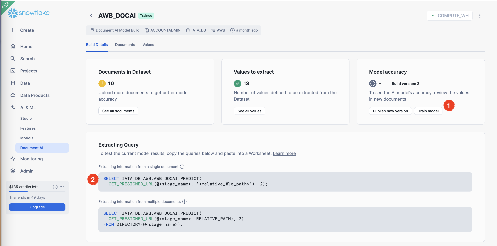

# Snowflake Backend Overview
The application will utilize Snowflake as the backend data warehouse to store, process, and analyze various document types, including airway bills (AWB), invoices, phytosanitary documents, and regulatory documents like IATA's Perishable Cargo Regulation (PCR). Uploaded documents will be classified into document types using the Cortex Classify_Text() function to ensure that necessary information is extracted according to document type. Snowflake's Document AI capability will then extract relevant information from these documents into a predefined format, ensuring data accuracy and completeness.

Cortex Search, a fully managed, low-latency hybrid search service, will be employed to identify the required documents associated with the processed AWB. By combining vector and keyword search capabilities, Cortex Search will deliver high-quality "fuzzy" search functionality over Snowflake data and documents. This is an optimized RAG (Retrieval Augmented Generation) capability that does not require expertise to create a RAG flow. This service automatically creates the embeddings and stores in Snowflake's native vector data type.

Retrieved results will be processed using the Llama 8b model to generate contextualized JSON responses for seamless integration into the application layer. Several LLM options hosted in Snowflake were tested, and it was determined that even a small model like Llama 8b is sufficient to generate high-quality results for this use case.

Snowflake offers various connection options for interacting with applications, such as Rest API, JDBC, ODBC, Go, and .Net. In this POC, we utilized the JDBC driver to invoke Snowflake functions from the middle layer. By the end of this guide, you will discover examples of SQL functions and stored procedures being employed directly by the middle layer via a JDBC connection.

## Steps to prepare Snowflake environment
The "Cortex Search (RAG) and other functions.sql" file encompasses SQL code to construct all objects and functions, excluding the Document AI segment. This portion necessitates the preparation of models through the Snowflake UI. Below is a comprehensive guide to creating the objects, uploading files, and generating Document AI Models.

### 1. Create Database, Warehouse and Stages
We will start by creating a database to store our data, documents and files. Snowflake stages will be utilized for storing files, which can accommodate various file types, including PDFs and images. Other important object in this step is a warehouse which will run our SQL and functions.

```
USE ROLE accountadmin;

CREATE OR REPLACE WAREHOUSE COMPUTE_WH WITH WAREHOUSE_SIZE='X-SMALL';
CREATE OR REPLACE DATABASE IATA_DB;
CREATE OR REPLACE SCHEMA AWB;

USE WAREHOUSE COMPUTE_WH;
USE DATABASE IATA;
USE SCHEMA AWB;

-- Location to upload documents from front end application
CREATE OR REPLACE STAGE IATA_DB.AWB.DOCS
    DIRECTORY = (ENABLE = TRUE)
    ENCRYPTION = (TYPE = 'SNOWFLAKE_SSE');

-- Location to store PCR document
CREATE OR REPLACE STAGE IATA_DB.AWB.PCR
    DIRECTORY = (ENABLE = TRUE)
    ENCRYPTION = (TYPE = 'SNOWFLAKE_SSE');
```

### 2. Upload PCR Document
Navigate to Snowflake home and locate PCR stage which was created in previous step. Upload the PCR document to this folder.


### 3. Prepare RAG for PCR document with Cortex Search
#### a. Extract text from the uploaded file
A table (PCR_TEXT) is created to store the extracted text content from PCR PDF file stored in stage (@IATA_DB.AWB.PCR).
The SNOWFLAKE.CORTEX.PARSE_DOCUMENT function extracts the content using OCR or layout-based parsing.
```
----------------------------------
-------Parse PCR Document---------
----------------------------------
CREATE OR REPLACE TABLE PCR_TEXT AS
SELECT RELATIVE_PATH as file_name, SNOWFLAKE.CORTEX.PARSE_DOCUMENT(
   @IATA_DB.AWB.PCR, -- stage
   RELATIVE_PATH, -- relative path
   {'mode': 'layout'} -- OCR or Layout modes
):content as contents FROM DIRECTORY(@IATA_DB.AWB.PCR) where RELATIVE_PATH LIKE '%.pdf';

select * from pcr_text limit 10;
```
#### b. Split text into chunks
The extracted text is divided into chunks of 3000 characters each, with a 1000-character overlap between consecutive chunks.
A new table (PCR_CHUNKED) is created to store these chunks, along with the file name for context.
This enables efficient processing and retrieval of smaller text segments.
```
----------------------------------------------------------------------
-- Chunk the file contents into 3000 character chunks, overlap each
-- chunk by 1000 characters.
----------------------------------------------------------------------
CREATE or REPLACE TABLE PCR_CHUNKED AS
SELECT
   file_name,
   c.value::VARCHAR chunk_text
FROM
   PCR_TEXT,
   LATERAL FLATTEN( input => SNOWFLAKE.CORTEX.SPLIT_TEXT_RECURSIVE_CHARACTER (
      contents,
      'markdown',
      3000,
      1000
   )) c;

select * from PCR_CHUNKED limit 10;
```
#### c. Create Cortex Search Service for RAG
Cortex Search service (PCR_SEARCH) is created to facilitate retrieval-augmented generation (RAG).
It indexes the text chunks (CHUNK_TEXT) and associates them with their corresponding file names (FILE_NAME).
This service allows efficient search and retrieval of relevant content for querying.
```
----------------------------------------------------------
---Create RAG Search Service for searching PCR Document---
----------------------------------------------------------
CREATE OR REPLACE CORTEX SEARCH SERVICE PCR_SEARCH
    ON CHUNK_TEXT
    ATTRIBUTES FILE_NAME
    WAREHOUSE = compute_wh
    TARGET_LAG = '30 day'
    AS ( SELECT CHUNK_TEXT, FILE_NAME 
    FROM PCR_CHUNKED );
```
### 4. Create Functions to Call From the Application
In this step, we will create 2 stored procedures to enable our application to easily communicate with Snowflake and consume Cortex AI functions for different purposes.

#### Document Type Detection (CHECK_DOC_TYPE)
When end-users upload documents, the system automatically determines the document type using the CHECK_DOC_TYPE procedure. This function processes the document with OCR to extract content, then classifies it into predefined categories (e.g., "Airway Bill," "Invoice") and returns the document type. Output of this function is used to call the convenient Document AI model according to document type.
```
-- Create function to detect document types
CREATE OR REPLACE PROCEDURE "CHECK_DOC_TYPE"("DOC_NAME" VARCHAR(16777216))
RETURNS VARCHAR(16777216)
LANGUAGE SQL
EXECUTE AS OWNER
AS 'declare doc_type varchar;
begin 
  create or replace temp table document_putput as
(select SUBSTR(replace(SNOWFLAKE.CORTEX.PARSE_DOCUMENT(
    @IATA_DB.AWB.DOCS,
    :doc_name,
    {''mode'': ''OCR''}
  )[''content''],'''''''',''''),0,200) as content);
  select (snowflake.cortex.classify_text(content,[''Airway Bill'',''Pythosanitary Document'',''Packing List'', ''Invoice'']))[''label'']::varchar into :doc_type from document_putput;
return doc_type;
end';
```

#### Function to Return Required Document List (PCR_SEARCH)
This function utilizes the PCR_SEARCH service to find relevant documents from PCR content based on the input search string (SEARCH_STRING) and a predefined list of required documents (DOC_LIST). It processes the search query using the SEARCH_PREVIEW method and employs an LLM to deduplicate and match the retrieved results with DOC_LIST. The output is a JSON response containing a consolidated and deduplicated list of required document names. 
```
-- Create search function to search AWB information and match list of documents against PCR document using RAG capabilities.
CREATE OR REPLACE PROCEDURE "SEARCH_PCR"("SEARCH_STRING" VARCHAR(16777216), "DOC_LIST" VARCHAR(16777216))
RETURNS TABLE ("LLM_RES" VARCHAR(16777216))
LANGUAGE SQL
EXECUTE AS OWNER
AS 'DECLARE
 res RESULTSET;
 search_string_conv varchar;
BEGIN

select snowflake.cortex.complete(''llama3.1-8b'', ''convert destination and origin airport codes to country names in the following text. Do not add any explanation or do not start with Here is the text.: ''||:search_string) as conv into :search_string_conv ;

create or replace temp table cortex_search_result as
  (SELECT (
  SNOWFLAKE.CORTEX.SEARCH_PREVIEW(
      ''PCR_SEARCH'', --Search service name
       concat(''{
         "query": "'','' Supplementary Documents required for: '', :search_string_conv ,''",
          "columns":["CHUNK_TEXT"],"limit":5}'')
          )
    ) as chunk);
 res :=(SELECT snowflake.cortex.complete(
    ''llama3.1-8b'', 
     CONCAT(''You are a helpful AI chat assistant for Airway Cargo document inspection with RAG capabilities. Ensure the answer is coherent, concise,and directly relevant to the question of user.Dont say things like "according to the provided context", here is the list of documents required for AWB. Do no add any explanation, Only return the list: '',
        (select chunk from cortex_search_result),
        ''Combine this list with doc_list, deduplicate the results and return a JSON as list of documents with only document name as attribute: '',
        ''doc_list: '',:doc_list,
        '' Question: '', concat(''Combine the Chunk_Texts and find What are the required documents for following AWB content and deduplicate similar documents: '', :search_string),
        '' Answer: ''
    )
) llm_response);
    
    return table(res);
END';
```

### 5. Create Document AI Models
In order to extract pre-defined fields from documents, we will create seperate Document AI models for each document types.
Snowflake Document AI is a feature within the Snowflake Data Cloud that uses artificial intelligence to extract and process data from various document formats. It leverages the Arctic-TILT large language model, a proprietary multimodal LLM developed by Snowflake, specifically designed for document understanding tasks.

Document AI requires uploading sample documents to train the model and defining values to be extracted. Result of extraction will a JSON output which can be easily consumed by application layer.

#### a. Document AI Interface 
We will first navigate to Document AI interface which is part of Snowflake's web UI. In this interface, we will create 3 models: AWB_DocAI, PCR and Invoice via Build button on top right.


#### b. Build New Model
We will start with AWB model creation and repeat below steps for each document type.
Fill out the model name and select the schema which will host the Document AI model.


#### c. Upload Files
Upload the sample files for training your model. In our examples, we used 2-3 documents to train the model but it is recommended to use around 20 documents.


#### d. Define Values
Once the documents are uploaded, hit the "Define Values" to define the which fields will be extracted from the document and turned into a JSON output. Defining values means, asking questions about the documents. Each question will be converted into a value in our output JSON. If the answer of question is not correct, you should copy and paste the correct value from the document displayed on the right hand side. Document AI will respect these values to fine tune the model in next step.


#### e. Train the Model
Finally, we are ready to fine tune our model with the values that we defined in the previous step, just by asking questions. Fine tuning will run in the backend may take several minutes. Once it is completed, you will find the extraction SQL function displayed in the second step below.


**Repeat** above from step A to E for each document type listed below.

| Document Type  | Model Name | Questions File |
| ------------- | ------------- | ------------- |
| Airway Bill (AWB)  | AWB_DOCAI  | [awb_model](document-ai-questions/awb_model.csv)|
| Pythosanitory Document  | PCR  |  [phytosanitary_model](document-ai-questions/phytosanitary_model.csv) |
| Invoice  | INVOICE  | [invoice_model](document-ai-questions/invoice_model.csv) |

## Example Function Calls

Cortex Service (RAG) 
```
CALL IATA_DB.AWB.SEARCH_PCR('GOODS:FRUITS EXCL STRAWBERRIES VEGETABLES, Destination:DOH, Origin:BOM','Invoice, Packing List');
```

Document AI Functions to Extract information from documents
```
SELECT PARSE_JSON(IATA_DB.AWB.AWB_DOCAI!PREDICT(GET_PRESIGNED_URL(@IATA_DB.AWB.DOCS, 'AWB_Sample_1.pdf'))) as output;
SELECT PARSE_JSON(IATA_DB.AWB.PCR!PREDICT(GET_PRESIGNED_URL(@IATA_DB.AWB.DOCS, 'phytosanitaryCertificate_sample_1.pdf'))) as output;
SELECT PARSE_JSON(IATA_DB.AWB.INVOICE!PREDICT(GET_PRESIGNED_URL(@IATA_DB.AWB.DOCS, 'invoice_sample_1.pdf'))) as output;
```
Document type detection
```
CALL CHECK_DOC_TYPE('phytosanitaryCertificate_sample_1.pdf');
```

